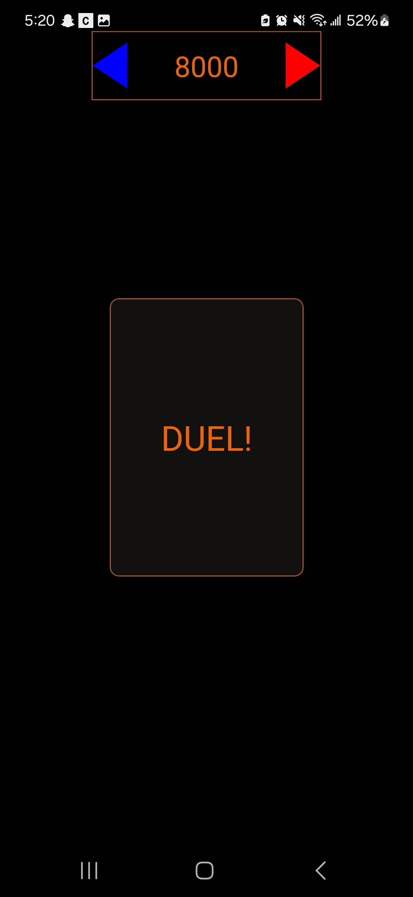
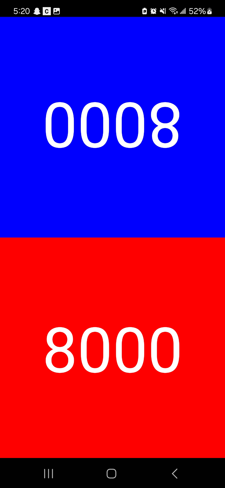
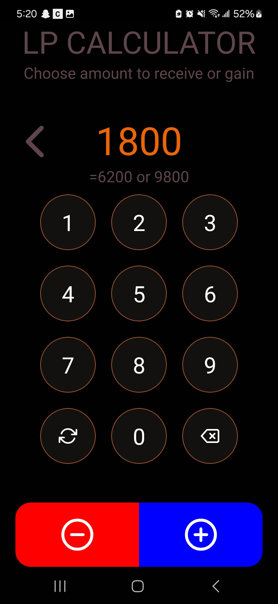

# YugiohCounterApp

>**Description**: A counter app for when playing the Yugioh card game. Built using the React Native API. Currently only for Android. Intended to be used between two players.

## Images

    
    
    

### Component I want to mention
The win screen video can be changed or added in **ending_videos**, located in **BattleScreen.tsx**.

## Links
Documented my learning process of how I got my React Native Environment working in a [Google Doc](https://docs.google.com/document/d/1Out3DU4R-71vg8VJUe2MyoLvWDzBn5Rl1r2ZgyA8gmQ/edit?usp=sharing)
The app can still be improved upon so I won't release it yet, but here's the current [version](https://drive.google.com/drive/folders/1TpXe28ntMHYhu457mrDiDV-Cckv9szy7?usp=sharing)